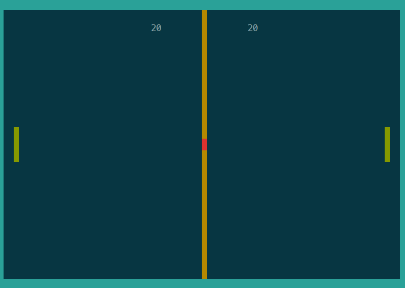

[На русском 🇷🇺](README_RUS.md)

# Pong Game
A classic implementation of the Pong game with two versions: console and interactive (ncurses). Common game logic is modularized in pong_common.



## Contents

- [Game Description](#game-description)
- [How to Play](#how-to-play)
- [Installation and Launch](#installation-and-launch)
- [Project Structure](#project-structure)
- [Technical Details](#technical-details)

## Game Description

Pong is one of the first computer games, released in 1972 by Atari. The game simulates table tennis: two players control paddles (vertical bars) on opposite sides of the screen, bouncing a ball back and forth.

## How to Play

### Controls
- **Player 1 (left)**: 
  - `A` - move up
  - `Z` - move down
- **Player 2 (right)**: 
  - `K` - move up
  - `M` - move down
  - `Q` - quit game

### Rules
- Game goes up to 21 points
- A point is scored when the opponent misses the ball
- Ball speeds up after bouncing off paddles
- Bounce angle depends on where the ball hits the paddle

## Installation and Launch

### Using Makefile (Recommended)
```bash
make        # Build both versions
make pong   # Build console version only
make pong_interactive  # Build interactive version only
```

Or build manually:

### Console Version
```bash
gcc pong.c -o pong
./pong
```

### Interactive Version (ncurses)
```bash
gcc pong_interactive.c -o pong_interactive -lncurses
./pong_interactive
```

## Technical Details

### Console Version
- Uses ANSI escape sequences for graphics
- Blocking input

### Interactive Version
- Uses ncurses library
- Non-blocking input with delay
