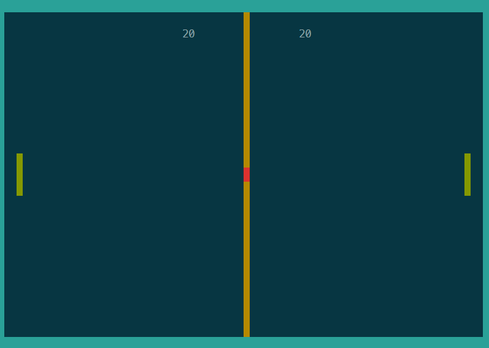

# Pong Game
Классическая реализация игры Pong с двумя версиями: консольной и интерактивной (ncurses). Общая логика игры вынесена в модуль pong_common.



## Содержание

- [Описание игры](#описание-игры)
- [Как играть](#как-играть)
- [Установка и запуск](#установка-и-запуск)
- [Структура проекта](#структура-проекта)
- [Технические детали](#технические-детали)

## Описание игры

Pong - одна из первых компьютерных игр, выпущенная в 1972 году компанией Atari. Игра имитирует настольный теннис: два игрока управляют ракетками (вертикальными полосками) на противоположных сторонах экрана, отбивая мяч вперёд-назад.

## Как играть

### Управление
- **Игрок 1 (слева)**: 
  - `A` - движение вверх
  - `Z` - движение вниз
- **Игрок 2 (справа)**: 
  - `K` - движение вверх
  - `M` - движение вниз
- `Q` - выход из игры

### Правила
- Игра идёт до 21 очка
- Очко начисляется, когда противник пропускает мяч
- Мяч ускоряется после отскока от ракетки
- Угол отскока зависит от места попадания мяча в ракетку

## Установка и запуск

### Используя Makefile (Рекомендуется)
```bash
make        # Собрать обе версии
make pong   # Собрать только консольную версию
make pong_interactive  # Собрать только интерактивную версию
```

Или собрать вручную:

### Консольная версия
```bash
gcc pong.c -o pong
./pong
```

### Интерактивная версия (ncurses)
```bash
gcc pong_interactive.c -o pong_interactive -lncurses
./pong_interactive
```

## Технические детали

### Консольная версия
- Использует ANSI escape-последовательности для управления графикой
- Блокирующий ввод 

### Интерактивная версия
- Использует библиотеку ncurses
- Неблокирующий ввод с задержкой
